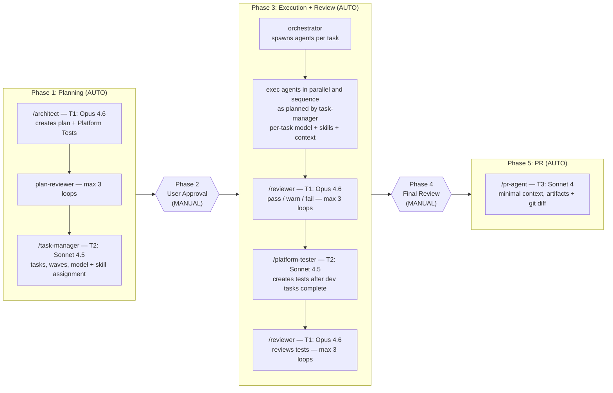

# Cursor IDE Agent Orchestration Ecosystem

A governed multi-agent platform for infrastructure engineering — a lightweight workflow engine with AI-assisted workers operating under strict contracts.

## Who This Is For

- Platform engineers managing AWS + EKS infrastructure
- DevOps teams implementing GitOps workflows
- Organizations requiring controlled, auditable AI-assisted engineering

## Architecture

### Mental Model

```
Phase 1 → Compiler       (plan → execution graph)
Phase 2 → Human gate     (approval checkpoint)
Phase 3 → Executor       (deterministic execution + bounded correction loops)
Phase 4 → Human gate     (validation checkpoint)
Phase 5 → Delivery       (PR pipeline)
```

Planning is deterministic. Execution is deterministic under fixed inputs, models, and environment. Re-execution is safe (tasks are idempotent + dependency-enforced). Only human judgment gates are non-deterministic — and those are the two manual phases.

### 5-Phase Hybrid Workflow

| Phase | Mode | What Happens |
|-------|------|-------------|
| **1. Planning** | AUTO | Architect creates plan → plan-reviewer validates (max 3 loops) → task-manager builds execution strategy |
| **2. Approval** | MANUAL | User reviews plan + execution strategy. Approve or request changes. |
| **3. Execution** | AUTO | Orchestrator spawns agents per task → auto-review → tests after dev complete |
| **4. Final Review** | MANUAL | User reviews all generated files and artifacts |
| **5. PR Creation** | AUTO | User triggers → PR agent runs with minimal context |

### Workflow Diagram



### Role Separation

```
/architect       = WHAT to build (Phase 1)
/task-manager    = HOW to break it into executable work (Phase 1b)
/orchestrator    = Routes + coordinates (Phases 1→3→5)
/iac-dev etc.    = DO the work (Phase 3)
/reviewer        = VERIFY the work (Phase 3b)
/pr-agent        = Ship the work (Phase 5)
```

### Agent Ecosystem

| Command | Agent | Phase | Model | Specialization |
|---------|-------|-------|-------|----------------|
| `/architect` | AWS Cloud Architect | Phase 1 | T1: Opus 4.6 | Architecture design, infrastructure planning |
| `/task-manager` | Task Manager | Phase 1b | T2: Sonnet 4.5 | Decomposition, execution waves, model/skill assignment |
| `/iac-dev` | IaC Developer | Phase 3 | Per-task | Terraform, Helm, YAML implementation |
| `/k8s-expert` | Kubernetes Expert | Phase 3 | Per-task | EKS, pods, networking analysis |
| `/devops` | DevOps Engineer | Phase 3 | Per-task | CI/CD, GitHub Actions, monitoring |
| `/reviewer` | Security Reviewer | Phase 3b | T1: Opus 4.6 | Security audit, automated review loops |
| `/platform-tester` | Platform Tester | Phase 3c | T2: Sonnet 4.5 | Test automation after dev tasks complete |
| `/pr-agent` | PR Agent | Phase 5 | T3: Sonnet 4 | Git workflow, PR creation, Slack notifications |
| `/check-progress` | Progress Check | Any | T3: Sonnet 4 | Status and phase check |

**Orchestrator:** Two modes — **Routing** (routes user intent to the right phase/agent) and **Execution** (Phase 3 — reads the plan, spawns agents per task with assigned model/skills/context). The Execution Strategy is a binding contract — the orchestrator executes it without reinterpretation (muscle, not brain).

## Quick Start

### 1. Setup

```bash
~/.cursor/agents/     → cursor/cursor-config/agents/
~/.cursor/commands/   → cursor/cursor-config/commands/
~/.cursor/rules/      → cursor/cursor-config/rules/
~/.cursor/skills/     → cursor/cursor-config/skills/
```

MCP: `cp ~/.dotfiles/cursor/mcp.json.template ~/.cursor/mcp.json` — edit with your credentials (Atlassian, Slack, etc.).

### 2. Standard Workflow

```
Phase 1 (AUTO):    /architect → plan-review loop → task-manager
Phase 2 (MANUAL):  User reviews and approves plan + execution strategy
Phase 3 (AUTO):    Orchestrator executes tasks → auto-review → tests
Phase 4 (MANUAL):  User reviews all generated files
Phase 5 (AUTO):    User triggers → /pr-agent creates PR automatically
```

### 3. Shortcuts

| Pattern | Flow |
|---------|------|
| **New infrastructure** | Full 5-phase: `/architect` → approve → auto-execute → review → PR |
| **Quick config change** | `/iac-dev` → `/reviewer` → `/pr-agent` (skip Phase 1) |
| **CI/CD work** | `/architect` → `/devops` → `/reviewer` → `/pr-agent` |
| **Troubleshooting** | `/k8s-expert` or `/devops` (analysis only) |

Shortcuts bypass the full 5-phase flow. Safety rules and review gates still apply.

## How It Works

### Component Model

```
You type /architect
       │
       ▼
commands/architect.md  ──→  agents/architect.md  (persona activated)
                                    │
                       ┌────────────┼────────────┐
                       ▼            ▼            ▼
                rules/*.mdc    skills/aws/    skills/terraform/
              (always active)  (read if needed) (read if needed)
```

| Component | Role | Activates |
|-----------|------|-----------|
| **Commands** (`commands/*.md`) | Thin wrapper that loads one agent persona | You type it |
| **Agents** (`agents/*.md`) | Persona: tier, tools policy, handoff rules, skill refs | On command invocation or `@` reference |
| **Rules** (`rules/*.mdc`) | Safety constraints, workflow routing, token governance | Always active (Cursor injects) |
| **Skills** (`skills/**/SKILL.md`) | Domain knowledge and procedures | On-demand — agent reads when task matches |

### Automation Model

**Automated phases (1, 3, 5):** The orchestrator auto-selects models, scopes skills and context, spawns agents, and routes between them. Review loops run automatically (max 3 iterations). Critical blockers escalate to user.

**Manual phases (2, 4):** You review the output and decide — approve, request changes, or trigger the next phase.

### Failure Handling

| Mechanism | Where | Limit |
|-----------|-------|-------|
| Plan review loop | Phase 1 (architect ↔ plan-reviewer) | Max 3 iterations |
| Fix-review loop | Phase 3 (exec agent ↔ reviewer) | Max 3 iterations per task |
| Model escalation | Phase 3 (on 2 failures at same tier) | T3 → T2 → T1 |
| Critical blocker | Any automated phase | Always escalates to user |

**Blocker classification:** Every issue is classified as **Fixable** (stays in loop), **Risky** (warn + continue, include in Phase 4 summary), or **Critical** (must stop — missing input, ambiguous requirement, security violation, or max loops exhausted).

**Failure propagation (Phase 3):** On critical blocker — freeze current wave, preserve completed tasks, mark downstream as BLOCKED, escalate to user, resume only after user input.

### Execution Guarantees

- **Deterministic** (under fixed inputs/models/environment) — Execution Strategy is a binding contract; orchestrator follows it without reinterpretation
- **Idempotent + dependency-enforced** — every task is safe to re-run (file overwrite, external read-only); wave freezing + dependency blocking ensure safe re-execution even after partial failure
- **Task identity** — each task has a stable ID from the Execution Strategy; all retries, reviews, and artifacts reference this ID for traceability
- **Model fixity** — retries use the same model; upgrades only on explicit escalation (2 failures → tier up)
- **Versioned** — Execution Strategy has a version number; orchestrator executes only the latest approved version
- **Resume semantics** — two paths after failure: **Execution Resume** (same version, continue from frozen wave) or **Plan Revision** (new version, re-evaluate task validity, re-execute invalidated tasks)

### Plan State Header

Every `.plan.md` tracks workflow state in its header. This is the single source of truth for where the plan is in the lifecycle.

**Full header format:**

```
> **Plan** | `add-aurora-cluster`
> **Status** | `In Progress` | **Priority** | `P2`
> **Created** | `2026-05-08` | **Updated** | `2026-05-08`
> **Author** | `SHELYOG` | **Environment** | `staging`
> **PR/Ticket** | `—` | **Rollback** | `Yes`
> **Phase** | `3-Execution` | **Wave** | `2`
> **Strategy Version** | `1` | **Active Tasks** | `T4, T5`
> **Blocked Tasks** | `—`
```

**Field definitions:**

| Field | Values | Meaning |
|-------|--------|---------|
| **Status** | `Draft` → `In Review` → `Approved` → `In Progress` → `Completed` | Lifecycle state. `Blocked` if waiting on user. |
| **Phase** | `1-Planning` / `2-Approval` / `3-Execution` / `4-Review` / `5-PR` / `Complete` | Current workflow phase |
| **Wave** | Integer or `—` | Current execution wave number (Phase 3 only) |
| **Strategy Version** | Integer or `—` | Starts at `1` when task-manager creates the Execution Strategy. Increments on every plan revision. `—` before strategy exists. |
| **Active Tasks** | Task IDs or `—` | Tasks currently running (Phase 3 only) |
| **Blocked Tasks** | Task IDs or `—` | Tasks paused on a critical blocker |

**Who updates what, when:**

| Event | Fields Updated | Updated By |
|-------|---------------|-----------|
| Architect creates plan | `Status: Draft`, `Phase: 1-Planning` | `/architect` |
| Plan-reviewer passes | `Status: In Review` | plan-reviewer |
| Task-manager creates strategy | `Strategy Version: 1` | `/task-manager` |
| System stops for approval | `Phase: 2-Approval` | `/task-manager` |
| User approves | `Status: Approved` | User |
| Orchestrator starts execution | `Status: In Progress`, `Phase: 3-Execution`, `Wave: 1` | orchestrator |
| Task starts | `Active Tasks: T1, T2` | orchestrator |
| Task completes | `Active Tasks` updated (remove completed) | orchestrator |
| Wave advances | `Wave` incremented | orchestrator |
| Critical blocker | `Status: Blocked`, `Blocked Tasks: T3` | orchestrator |
| User resolves blocker | `Status: In Progress`, `Blocked Tasks: —` | orchestrator |
| Plan revised after blocker | `Strategy Version` incremented, `Phase: 3-Execution` | `/task-manager` |
| All tasks + tests pass | `Phase: 4-Review`, `Active Tasks: —`, `Wave: —` | orchestrator |
| User approves final output | `Phase: 5-PR` | User |
| PR created | `Phase: Complete`, `Status: Completed` | `/pr-agent` |

On session resume, any agent reads these fields to determine exactly where to pick up. See `standards-plan.mdc` for format rules and immutability constraints.

## Governance

### AI/LLM Model Orchestration & Token Governance (v4.0)

Three-level cost optimization: **model selection** (right model per task), **skill scoping** (right knowledge per task), **token governance** (minimal context per session).

| Tier | Model | Version | Auto-Selected In |
|------|-------|---------|-----------------|
| **T1** | Claude Opus (high) | **4.6** | Phase 1 (architect, reviewer), Phase 3b (review) |
| **T2** | Claude Sonnet | **4.5** | Phase 1b (task-manager), Phase 3 (per task), Phase 3c (tests) |
| **T2-alt** | GPT Codex | **5.3** | Phase 3 (user preference alternative) |
| **T3** | Claude Sonnet | **4** | Phase 5 (PR creation) |

**Context optimization** — resets at every phase boundary:

| Transition | Context Passed |
|-----------|---------------|
| Architect → Task Manager | `.plan.md` only |
| Approval → Execution | Approved `.plan.md` only |
| Per task (Phase 3) | Assigned files + skills + model only |
| Review loops | Findings + affected files only |
| PR creation | Artifacts + git diff only |

**Token governance (Level 2):** Threshold enforcement (50% → 70% → 85% → 90%), phase-aware budget allocation, skill loading protocol. See `workflow-token-governance.mdc`.

### Safety Controls

- **No autonomous actions** on production systems
- **Command restrictions:** Terraform (`validate`/`fmt`/`plan` only), Kubernetes (read-only), AWS CLI (describe/get only), Git (no force push)
- **Execution constraints:** agents read/write only files in their task's scope; load only pre-mapped skills
- **Environment boundaries:** production requires written confirmation; never push to `main`/`master`
- **Plan immutability:** once approved, sections above `## Execution Strategy` are read-only
- **Parallel safety:** orchestrator must not parallelize tasks the task-manager marked sequential; write-write conflicts resolved before execution

### Verification Gates

All agents must provide **fresh evidence** before claiming completion — no "should work" or "looks correct". Commands like `terraform validate`, `helm lint` must pass. See `workflow-verification-gate.mdc`.

### Structured Artifacts

| File | Producer | Consumer | Content |
|------|----------|----------|---------|
| `.artifacts/review.md` | `/reviewer` | `/pr-agent`, CI | Security findings, status (`pass`/`warn`/`fail`) |
| `.artifacts/test-summary.md` | `/platform-tester` | `/pr-agent`, CI | Test coverage, validation results |

YAML frontmatter (`status`, `date`, `branch`) for machine parsing. CI checks can gate merge on `status`.

### Rules Naming Convention

| Prefix | Purpose | Examples |
|--------|---------|----------|
| `agent-cli-*` | CLI execution policy (what agents must NOT run) | `agent-cli-core.mdc`, `agent-cli-terraform.mdc`, `agent-cli-kubernetes.mdc`, `agent-cli-aws.mdc` |
| `standards-*` | Authoring & platform conventions | `standards-terraform.mdc`, `standards-aws-security.mdc`, `standards-eks.mdc`, `standards-plan.mdc` |
| `workflow-*` | Multi-agent workflow orchestration | `workflow-orchestrator.mdc`, `workflow-interactive-gate.mdc`, `workflow-verification-gate.mdc`, `workflow-token-governance.mdc` |

## Skills (21 Domain Modules)

| Category | Skills |
|----------|--------|
| **Cloud & Infra** | AWS, Terraform, EKS, Karpenter, RDS Aurora |
| **Containers & Orchestration** | Docker, Kubernetes, Helm |
| **Networking & Traffic** | Envoy Gateway, Calico, ExternalDNS, cert-manager |
| **CI/CD & Git** | GitHub Actions, GitHub Runners, Git PR Workflow |
| **Data & Messaging** | MSK/Kafka |
| **Security** | Wiz, tfsec/TFLint |
| **Observability** | Datadog |
| **Operations** | Velero (backup/DR) |
| **Workflow Control** | Ask Clarifying Questions (execution gate) |

## Directory Structure

```
.cursor/
├── README.md                        # This file
├── agents/                          # Agent persona definitions (11)
│   ├── architect.md                 # Phase 1: architecture planning (T1)
│   ├── plan-reviewer.md            # Phase 1: plan review loop (T1)
│   ├── task-manager.md             # Phase 1b: task decomposition (T2)
│   ├── orchestrator.md             # Dual-role: router + executor
│   ├── iac-dev.md                  # Phase 3: Terraform/Helm implementation
│   ├── k8s-expert.md              # Phase 3: Kubernetes analysis
│   ├── devops.md                   # Phase 3: CI/CD + observability
│   ├── reviewer.md                 # Phase 3b: security review (T1)
│   ├── platform-tester.md          # Phase 3c: test creation (T2)
│   ├── pr-agent.md                 # Phase 5: PR workflow (T3)
│   └── check-progress.md          # Utility: progress check (T3)
├── commands/                        # Slash command wrappers (9)
├── rules/                           # Behavioral guidelines (15 .mdc)
│   ├── workflow-orchestrator.mdc    # 5-phase orchestration, dual-role
│   ├── workflow-verification-gate.mdc  # Evidence before completion
│   ├── workflow-interactive-gate.mdc   # Phase-aware approval gates
│   ├── workflow-token-governance.mdc   # AI model + token governance (v4.0)
│   ├── agent-cli-core.mdc          # Core CLI policy (always on)
│   ├── agent-cli-terraform.mdc     # No mutating TF CLI
│   ├── agent-cli-kubernetes.mdc    # No mutating K8s CLI
│   ├── agent-cli-aws.mdc           # No mutating AWS CLI
│   ├── standards-terraform.mdc     # HCL conventions
│   ├── standards-aws-security.mdc  # Security guardrails
│   ├── standards-eks.mdc           # EKS best practices
│   ├── standards-github-actions.mdc # GHA standards
│   ├── standards-plan.mdc          # .plan.md structure
│   ├── standards-ci-cd.mdc         # CI/CD principles
│   └── standards-context-engineering.mdc  # Context discipline
└── skills/                          # Domain knowledge (21 skills)

# Created in the WORKING REPO (not in ~/.cursor):
<working-repo>/.artifacts/
    ├── review.md                    # From /reviewer
    └── test-summary.md              # From /platform-tester
```

## Contributing

### Adding New Agents
1. Create agent definition in `agents/`
2. Add slash command in `commands/` (thin wrapper: "Load `agents/<name>.md`")
3. Update `rules/workflow-orchestrator.mdc` routing table
4. Wire skills as needed

### Extending Skills
1. Create skill module in `skills/`
2. Follow established patterns
3. Include practical examples
4. Test with relevant agents

## Design Boundaries

### What this system IS

- **Hybrid automated workflow** — phases 1, 3, 5 automated; phases 2, 4 manual
- **Deterministic execution** — binding, versioned contract; deterministic under fixed inputs/models/environment
- **Idempotent + dependency-enforced** — safe to re-run; wave freezing ensures ordering on partial failure
- **Cost-optimized** — model auto-selection + skill scoping + context resets
- **Safety-first** — CLI bans, review loops, blocker classification, critical escalation
- **Artifact-anchored** — `.plan.md` and `.artifacts/` provide cross-session state
- **Git as audit trail** — artifact commits preserve review/test history

### What this system is NOT

| Expectation | Reality |
|-------------|---------|
| **Fully autonomous** | Phases 2 and 4 require human judgment. Critical blockers always escalate. |
| **Background scheduler** | Automation runs within a Cursor chat session, not as a background service. |
| **Event-driven** | Artifacts are passive files read at invocation time, not pub/sub. |

### Where Enforcement Lives

```
In-IDE (automated)     In-IDE (manual)         CI / merge (hard)
-------------------    -------------------     -------------------------
Phase 1 auto-chain     Phase 2 user approval   PR blocked if no review
Phase 3 auto-execute   Phase 4 user review     artifact or status != pass
Phase 5 auto-PR        Critical escalation     Branch protection rules
Review loops (max 3)   Model override          Required status checks
```

### When to Evolve Beyond This Model

- Multiple engineers need cross-session handoff without shared chat context
- Compliance requires machine-verifiable audit logs (not Git history)
- You need true background execution (not session-bound automation)
- Workflow branching becomes too complex for the 5-phase model

At that point, the right move is an **external orchestration layer** (CI-driven state machine, Temporal, or a supervisor service) with the Cursor SDK for agent execution.

---

**This is a governed multi-agent platform for infrastructure engineering** — distributed specialized agents, a hybrid automated orchestration layer, governance + policy enforcement, and context as a managed system. All configurations are version-controlled and team-shareable through dotfiles.
