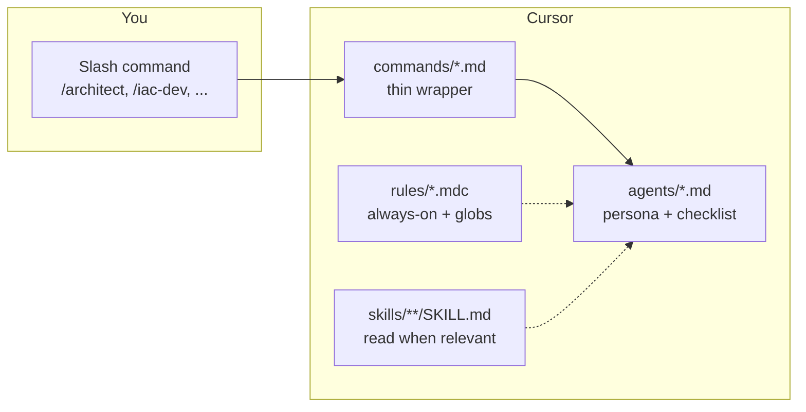

# Cursor IDE Agent Orchestration Ecosystem

A comprehensive cloud platform engineering system powered by specialized AI agents for AWS infrastructure, Kubernetes, and DevOps workflows.

## Architecture Overview

This dotfiles configuration provides a **three-tier agent orchestration system** for cloud platform engineering:

```
Tier 1 - Planning: /architect → plan-reviewer → USER approval
Tier 2 - Execution: /iac-dev | /k8s-expert | /devops
Tier 3 - Quality: /reviewer → /platform-tester → /pr-agent
```

### Agent Ecosystem

| Command | Agent | Tier | Phase | Specialization |
|---------|-------|------|-------|----------------|
| `/architect` | AWS Cloud Architect | 1 - Plan | Plan | Architecture design, infrastructure planning |
| `/iac-dev` | IaC Developer | 2 - Build | Build | Terraform, Helm, YAML implementation |
| `/k8s-expert` | Kubernetes Expert | 2 - Build | Build | EKS, pods, networking analysis |
| `/devops` | DevOps Engineer | 2 - Build | Build | CI/CD, GitHub Actions, monitoring |
| `/reviewer` | Security Reviewer | 3 - Quality | Review | Security audit, compliance checks |
| `/platform-tester` | Platform Tester | 3 - Quality | Test | Test automation, validation scripts |
| `/pr-agent` | PR Agent | 3 - Quality | PR | Git workflow, PR creation, Slack notifications |
| `/check-progress` | Progress Check | Utility | Any | Status and phase check |

### How commands, agents, rules, and skills connect

This repo does **not** run a background scheduler or auto-advance workflow steps. **You** choose when to invoke each slash command. Rules apply whenever Cursor includes them in context; agents describe **how** the model should behave **after** you pick a command.



| Piece | What it is | Automatic vs explicit |
|-------|------------|------------------------|
| **Slash commands** (`commands/*.md`) | Short prompts that tell the model to load one **`agents/<name>.md`** persona. Filename = command name (e.g. `platform-tester.md` → `/platform-tester`). | **Explicit.** You type `/...` in chat (or pick from the command palette). Nothing runs without that step. |
| **Agents** (`agents/*.md`) | Markdown **personas**: tier, tools policy, handoff text, which skills to load for which keywords. Not separate processes or daemons. | **Triggered only when** you used a slash command that points at that file, or when you paste/`@` that file and ask the model to follow it. |
| **Rules** (`rules/*.mdc`) | Cursor **project rules**: YAML frontmatter sets `alwaysApply` and/or **`globs`**. They constrain style, CLI safety, workflow routing, verification, etc. | **Automatic (Cursor injects them).** You do not "invoke" a rule. Always-on rules affect essentially every chat in this workspace; glob rules attach when matching files are in context. |
| **Skills** (`skills/**/SKILL.md`) | Packaged procedures and domain decisions (Terraform, AWS, Git PR workflow, etc.). Listed in agent files ("when task mentions X, load skill Y"). | **On-demand.** The model is instructed to **read** the skill file when the task matches (and may use tools to open it). Skills are **not** executed like scripts unless the skill text tells the agent to run specific commands—with your approval per **`workflow-interactive-gate.mdc`**. `/pr-agent` loads `skills/git-pr-workflow/SKILL.md` as part of its persona. |

**Plan reviewer (`agents/plan-reviewer.md`):** There is **no** `/plan-reviewer` slash command. After `/architect` drafts a `.plan.md`, continue in the same thread and ask for a **plan review pass**, or `@` `agents/plan-reviewer.md` so the model follows that persona—then you approve the plan before `/iac-dev`.

### Is the tier workflow automatic?

**No.** The diagram **Plan → Build → Review → Test → PR** is a **convention** and ordering hint, not an automated pipeline.

- **Routing (`workflow-orchestrator.mdc`):** If you describe work **without** typing a slash command, the model should **suggest** which `/command` fits and **stop**—not silently implement or jump tiers (unless you opt out with something like "just do it" or it is a trivial factual question).
- **Between phases:** After each agent finishes, it **recommends** the next step ("Use `/iac-dev`..."). **You** run the next slash command when you are ready. Tests (`/platform-tester`) are optional for small changes, as agent text describes.
- **Nothing** auto-runs Terraform apply, kubectl apply, Helm upgrade, or git push; **`workflow-interactive-gate.mdc`** and **`agent-cli-*`** rules reinforce that.

## Quick Start

### 1. Automatic Setup
The agent system is automatically configured by `bootstrap.sh`:

```bash
# All agent configurations are symlinked:
~/.cursor/agents/     → cursor/cursor-config/agents/
~/.cursor/commands/   → cursor/cursor-config/commands/
~/.cursor/rules/      → cursor/cursor-config/rules/
~/.cursor/skills/     → cursor/cursor-config/skills/
```

### 2. MCP Integration Setup
Configure MCP servers for enhanced capabilities:

```bash
# Copy template and add your API tokens
cp ~/.dotfiles/cursor/mcp.json.template ~/.cursor/mcp.json
```

Edit `~/.cursor/mcp.json` with your credentials:
- **Atlassian**: Site name, email, API token
- **Slack**: xoxc and xoxd tokens
- **Other integrations**: As needed

### 3. Standard Workflow

1. **Plan Phase**: Run `/architect` for new infrastructure; iterate plan review if needed, then approve the `.plan.md`
2. **Build Phase**: Run `/iac-dev` for implementation
3. **Quality Phase**: Run `/reviewer` → `/platform-tester` (when tests add value) → `/pr-agent`

## Core Features

### Skills-Based Knowledge System (21 domain skills)
- **AWS**: Service patterns, architecture decisions, DR, cost
- **Terraform**: HCL syntax, modules, state management, refactoring
- **Kubernetes**: Workloads, networking, security, scheduling
- **EKS**: Cluster config, add-ons, upgrades, networking modes
- **Helm**: Chart design, values patterns, deployment strategy
- **Docker**: Base images, multi-stage builds, ECR, security hardening
- **Karpenter**: NodePool design, instance selection, disruption, cost
- **Envoy Gateway**: Gateway API routing, TLS, traffic/security policies
- **GitHub Actions**: CI/CD workflows, security, environments
- **GitHub Runners**: ARC, self-hosted runners, scale sets, DinD
- **Datadog**: Monitoring, APM, log management, K8s integration
- **MSK/Kafka**: Cluster config, ACLs, Schema Registry, auth
- **Velero**: Backup, disaster recovery, CSI snapshots, restore
- **Calico**: CNI, network policies, Tigera operator
- **Wiz**: Admission control, runtime security, Terraform provider
- **RDS Aurora**: PostgreSQL clusters, credential management, replicas
- **cert-manager**: TLS automation, Issuers, DNS challenges
- **ExternalDNS**: Automated DNS record management, Gateway API
- **tfsec/TFLint**: Static analysis, pre-commit, quality gates
- **Ask Clarifying Questions**: Execution gate for ambiguous/risky requests
- **Git PR Workflow**: End-to-end commit → PR → Slack notification

### Verification Gates
All agents must provide **fresh evidence** before claiming completion:
- No "should work" or "looks correct" - only verified output
- Commands like `terraform validate`, `helm lint` must pass
- Security and compliance checks enforced

### Structured Artifacts (`.artifacts/`)

Quality agents persist their results as **structured files** so downstream agents, CI, and future sessions can consume them without relying on ephemeral chat:

| File | Producer | Consumer | Content |
|------|----------|----------|---------|
| `.artifacts/review.md` | `/reviewer` | `/pr-agent`, CI | Security findings, status (`pass`/`warn`/`fail`), remediation |
| `.artifacts/test-summary.md` | `/platform-tester` | `/pr-agent`, CI | Test coverage, validation results, skipped items |

Each artifact has **YAML frontmatter** (`status`, `date`, `branch`) for machine parsing. `/pr-agent` pulls key fields into the PR body automatically. CI checks can gate merge on `status`.

### Token Governance (v2.2)

Context is a managed resource — not passive input. Token governance operates as a **3-layer control system** enforced across all agents:

| Layer | Mechanism | Guarantee |
|-------|-----------|-----------|
| **Predictive** | Estimate token cost → pre-trim before execution | No mid-operation budget exhaustion |
| **Reactive** | Threshold enforcement (50% → 70% → 85% → 90%) | No runaway context growth |
| **Mathematical** | Monotonicity — token count cannot increase once threshold exceeded | Formal upper bound on context size |

**Key invariants:**
- **No growth under pressure** — if budget is stressed, context size MUST NOT increase
- **Shrink before expand** — adding new context requires shrinking existing context first
- **Phase-aware allocation** — Plan phase gets 60% context / 40% output; Review gets 30% / 70%
- **Skill loading protocol** — skills annotated with `<!-- CORE_DECISIONS -->` / `<!-- REFERENCE -->` markers; agents read only what they need

See `workflow-token-governance.mdc` for enforcement rules and `standards-context-engineering.mdc` for content discipline.

### Interactive Safety
- **No autonomous actions** on production systems
- All destructive operations require explicit approval
- Command policy is split: **always-on core** (`agent-cli-core.mdc`) plus **glob-scoped** `agent-cli-*.mdc` (Terraform, Kubernetes, AWS) when matching files are in context
- Environment boundary enforcement

### Rules naming (purpose, not duplicates)

| Prefix / pattern | Purpose | Examples |
|------------------|---------|----------|
| **`agent-cli-*.mdc`** | **Agent execution policy** — which **CLI** invocations the agent must **not** run (mutating / destructive); glob-scoped where noted. | `agent-cli-core.mdc` (always on), `agent-cli-terraform.mdc`, `agent-cli-kubernetes.mdc`, `agent-cli-aws.mdc` |
| **`standards-*.mdc`** | **Authoring & platform conventions** — HCL style, security baselines, EKS ops, plans, CI/CD, context discipline. | `standards-terraform.mdc`, `standards-aws-security.mdc`, `standards-eks.mdc`, `standards-plan.mdc`, `standards-github-actions.mdc`, `standards-ci-cd.mdc`, `standards-context-engineering.mdc` |
| **`workflow-*.mdc`** | **Multi-agent workflow** — routing, human-in-the-loop, evidence before handoff, token resource control. | `workflow-orchestrator.mdc`, `workflow-interactive-gate.mdc`, `workflow-verification-gate.mdc`, `workflow-token-governance.mdc` |

**Why two "AWS" rules?** `agent-cli-aws.mdc` = **CLI bans for the agent**. `standards-aws-security.mdc` = **security guardrails** for **design and IaC** (IAM, encryption, networking). Same distinction applies to **`standards-terraform.mdc`** (HCL conventions) vs **`agent-cli-terraform.mdc`** (no `terraform apply` from the agent).

## Directory Structure

```
.cursor/
├── README.md                        # This file
├── agents/                          # Agent persona definitions (10)
│   ├── architect.md                 # Tier 1: architecture planning
│   ├── plan-reviewer.md            # Tier 1: plan review (no slash command)
│   ├── orchestrator.md             # Routing + dependency waves (no slash command)
│   ├── iac-dev.md                  # Tier 2: Terraform/Helm implementation
│   ├── k8s-expert.md              # Tier 2: Kubernetes analysis
│   ├── devops.md                   # Tier 2: CI/CD + observability
│   ├── reviewer.md                 # Tier 3: security review
│   ├── tester.md                   # Tier 3: test creation
│   ├── pr-agent.md                 # Tier 3: PR workflow
│   └── check-progress.md          # Utility: progress check
├── commands/                        # Slash command wrappers (8)
│   ├── architect.md                # /architect
│   ├── iac-dev.md                  # /iac-dev
│   ├── k8s-expert.md              # /k8s-expert
│   ├── devops.md                   # /devops
│   ├── reviewer.md                 # /reviewer
│   ├── platform-tester.md         # /platform-tester
│   ├── pr-agent.md                 # /pr-agent
│   └── check-progress.md          # /check-progress
├── rules/                           # Behavioral guidelines (15 .mdc)
│   ├── workflow-orchestrator.mdc    # Routing, failure loops, artifacts
│   ├── workflow-verification-gate.mdc  # Evidence before completion
│   ├── workflow-interactive-gate.mdc   # Human approval gate
│   ├── workflow-token-governance.mdc   # Token resource control (v2.2)
│   ├── agent-cli-core.mdc          # Core CLI policy (always on)
│   ├── agent-cli-terraform.mdc     # No mutating TF CLI (glob-scoped)
│   ├── agent-cli-kubernetes.mdc    # No mutating K8s CLI (glob-scoped)
│   ├── agent-cli-aws.mdc           # No mutating AWS CLI (glob-scoped)
│   ├── standards-terraform.mdc     # HCL conventions
│   ├── standards-aws-security.mdc  # Security guardrails
│   ├── standards-eks.mdc           # EKS best practices (glob-scoped)
│   ├── standards-github-actions.mdc # GHA standards
│   ├── standards-plan.mdc          # .plan.md structure
│   ├── standards-ci-cd.mdc         # CI/CD principles (glob-scoped)
│   └── standards-context-engineering.mdc  # Context discipline
├── skills/                          # Domain knowledge (21 skills)
│   ├── aws/                        # AWS patterns + architecture
│   ├── terraform/                  # HCL, modules, state
│   ├── kubernetes/                 # Workloads, networking
│   ├── eks/                        # Cluster config, add-ons
│   ├── helm/                       # Chart design, values
│   ├── docker/                     # Containers, ECR
│   ├── datadog/                    # Monitoring, APM
│   ├── github/                     # Actions, workflows
│   ├── karpenter/                  # Node autoscaling
│   ├── envoy-gateway/             # Gateway API, traffic
│   ├── msk/                        # MSK, Kafka, Schema Registry
│   ├── velero/                     # Backup, DR, CSI snapshots
│   ├── calico/                     # CNI, network policies, Tigera
│   ├── wiz/                        # Admission control, runtime security
│   ├── rds-aurora/                 # Aurora PostgreSQL, DB management
│   ├── cert-manager/              # TLS automation, Issuers
│   ├── external-dns/             # DNS record automation
│   ├── github-runners/           # ARC, self-hosted runners
│   ├── tfsec-tflint/             # Static analysis, quality gates
│   ├── ask-clarifying-questions/  # Ambiguity gate
│   └── git-pr-workflow/           # Commit -> PR -> Slack

# Created in the WORKING REPO (not in ~/.cursor):
<working-repo>/.artifacts/              # Quality agent outputs
    ├── review.md                       # From /reviewer
    └── test-summary.md                 # From /platform-tester
```

## Usage Patterns

### New Infrastructure Project
```bash
/architect          # Design architecture, create .plan.md
# → User reviews and approves plan
/iac-dev           # Implement Terraform modules
/reviewer          # Security and compliance audit
/platform-tester   # Tests / validation scripts when warranted
/pr-agent          # Create PR with devops-platform review
```

### Quick Configuration Change
```bash
/iac-dev           # Make the change directly
/reviewer          # Quick security check
/pr-agent          # Commit and PR
```

### Troubleshooting Issues
```bash
/k8s-expert        # Analyze cluster problems
/devops            # Check CI/CD pipeline issues
```

## Safety and Compliance

### Command Restrictions
- **Terraform**: Only `validate`, `fmt`, `plan` - never `apply`
- **Kubernetes**: Only read operations - no `apply`, `delete`
- **AWS CLI**: Only describe/get operations - no create/delete
- **Git**: Safe operations only - no force push

### Environment Protection
- Production changes require explicit approval
- No direct cluster modifications
- All changes go through PR workflow
- Verification evidence required

### Security Standards
- IAM least privilege enforcement
- Encryption at rest and in transit
- VPC security group validation
- Secret management compliance

## Monitoring and Observability

The ecosystem includes built-in observability through:
- **Datadog integration** for infrastructure monitoring
- **GitHub Actions** for workflow visibility
- **Slack notifications** for team coordination
- **Progress tracking** via `/check-progress`

## Contributing

### Adding New Agents
1. Create agent definition in `agents/`
2. Add corresponding slash command in `commands/` (thin wrapper: "Load `agents/<name>.md`")
3. Update `rules/workflow-orchestrator.mdc` routing table if the agent should appear in mandatory routing
4. Add or wire skills as needed

### Extending Skills
1. Create skill module in `skills/`
2. Follow established patterns for domain knowledge
3. Include practical examples and references
4. Test with relevant agents

## Design Boundaries

This system is a **governance-first orchestration framework** — not a runtime engine or autonomous scheduler. Understanding what it is and isn't prevents misaligned expectations.

### What this system IS

- **Structured multi-agent workflow** with specialized personas, skills, and safety rules
- **Human-routed**: you choose which agent runs next via slash commands
- **Artifact-anchored**: `.plan.md` and `.artifacts/` provide cross-session state
- **Safety-first**: interactive gates + CLI bans prevent autonomous mutation
- **Git as audit trail**: artifact commits preserve review/test history

### What this system is NOT

| Expectation | Reality |
|-------------|---------|
| **Enforced transitions** | Agent rules instruct the model to refuse invalid flows (e.g., `/pr-agent` refuses if review `status: fail`), but there is no hard runtime lock. CI merge gates are the enforcement layer for what matters most (merge). |
| **Runtime orchestrator** | No background scheduler evaluates state and dispatches agents. The human is the router. This is intentional for regulated infrastructure work where **control > automation speed**. |
| **Event-driven reactivity** | Artifacts are passive files. No event bus triggers the next agent on write. Agents read artifacts at invocation time and adapt behavior—read-time reactivity, not pub/sub. |
| **Full audit without Git** | Artifacts are overwritten on re-review; the audit trail lives in **Git commit history** (agents commit before overwriting). There is no append-only log file or database. |

### Where enforcement actually lives

```
In-IDE (soft)          CI / merge (hard)
-----------------      -------------------------
Agent refuses PR       PR blocked if no review artifact
if status: fail        or if status != pass/warn

Model follows          Required status checks
routing rules          on protected branches

Interactive gate       Branch protection rules
asks before acting     prevent direct push to main
```

### When to consider evolving beyond this model

- Multiple engineers need to hand off work across sessions without shared chat context
- Compliance requires machine-verifiable audit logs (not Git history)
- Workflow branching becomes too complex for a human to track mentally
- You need parallel agent execution with result aggregation

At that point, the right move is an **external orchestration layer** (CI-driven state machine, Temporal, or a supervisor service) — not more markdown rules.

---

**Note**: This system is designed for cloud platform engineering teams managing AWS infrastructure, EKS clusters, and DevOps workflows. All configurations are version-controlled and team-shareable through dotfiles.
