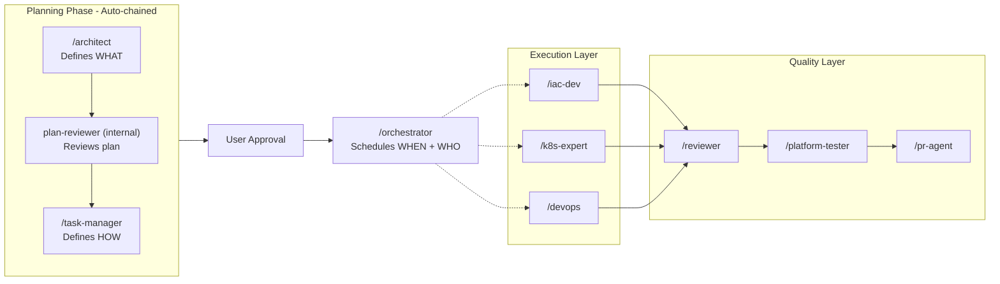

# Cursor IDE Agent Orchestration Ecosystem

A governed multi-agent platform for infrastructure engineering — distributed specialized agents, orchestration layer, governance + policy enforcement, and context as a managed system.

## Who This Is For

- Platform engineers managing AWS + EKS infrastructure
- DevOps teams implementing GitOps workflows
- Organizations requiring controlled, auditable AI-assisted engineering

**Not designed for:**
- Autonomous code generation systems
- Non-infrastructure domains

## Architecture

### Role Separation

Each phase of the workflow has a dedicated owner. These roles are intentionally separated and must not be merged.

```
/architect       = WHAT to build
/task-manager    = HOW to break it into executable work
/orchestrator    = WHEN + WHO executes
/iac-dev etc.    = DO the work
/reviewer        = VERIFY the work
```

### Workflow



### Tiers

```
Tier 1   - Planning:       /architect → plan-reviewer (internal)
Tier 1.5 - Task Planning:  /task-manager → USER approval
Tier 2   - Execution:      /iac-dev | /k8s-expert | /devops
Tier 3   - Quality:        /reviewer → /platform-tester → /pr-agent
```

### Agent Ecosystem

| Command | Agent | Tier | Phase | Specialization |
|---------|-------|------|-------|----------------|
| `/architect` | AWS Cloud Architect | 1 - Plan | Plan | Architecture design, infrastructure planning |
| `/task-manager` | Task Manager | 1.5 - Plan Refinement | Task Planning | Decomposition + simulation: task graph, conflict detection, execution waves |
| `/iac-dev` | IaC Developer | 2 - Build | Build | Terraform, Helm, YAML implementation |
| `/k8s-expert` | Kubernetes Expert | 2 - Build | Build | EKS, pods, networking analysis |
| `/devops` | DevOps Engineer | 2 - Build | Build | CI/CD, GitHub Actions, monitoring |
| `/reviewer` | Security Reviewer | 3 - Quality | Review | Security audit, compliance checks |
| `/platform-tester` | Platform Tester | 3 - Quality | Test | Test automation, validation scripts |
| `/pr-agent` | PR Agent | 3 - Quality | PR | Git workflow, PR creation, Slack notifications |
| `/check-progress` | Progress Check | Utility | Any | Status and phase check |

**Planning auto-chain:** `/architect` may invoke the planning sequence in one user session: `/architect` → plan-reviewer (internal) → `/task-manager`. This does not merge responsibilities — each agent still owns a separate phase; the command only streamlines the user workflow before approval. Plan-reviewer and task-manager remain available as standalone agents via `@` for re-runs on existing plans.

**Orchestrator note:** `/orchestrator` is a coordination persona used by the workflow rules. It is not usually invoked directly as a slash command.

## Quick Start

### 1. Setup

The agent system is automatically configured by `bootstrap.sh`:

```bash
~/.cursor/agents/     → cursor/cursor-config/agents/
~/.cursor/commands/   → cursor/cursor-config/commands/
~/.cursor/rules/      → cursor/cursor-config/rules/
~/.cursor/skills/     → cursor/cursor-config/skills/
```

MCP integration:

```bash
cp ~/.dotfiles/cursor/mcp.json.template ~/.cursor/mcp.json
```

Edit `~/.cursor/mcp.json` with your credentials (Atlassian, Slack, etc.).

### 2. Standard Workflow

```bash
/architect          # Design + review + task decomposition (auto-chained)
# → User approves complete plan + execution strategy
/iac-dev           # Implement per wave plan (DO)
/reviewer          # Security and compliance audit (VERIFY)
/platform-tester   # Tests / validation scripts when warranted
/pr-agent          # Create PR with devops-platform review
```

### 3. Shortcuts

| Pattern | Flow |
|---------|------|
| **New infrastructure** | `/architect` (auto-chains review + task decomposition) → approve → `/iac-dev` → `/reviewer` → `/pr-agent` |
| **Quick config change** | `/iac-dev` → `/reviewer` → `/pr-agent` |
| **CI/CD work** | `/architect` → `/devops` → `/reviewer` → `/pr-agent` |
| **Troubleshooting** | `/k8s-expert` or `/devops` (analysis only) |
| **Simple plan** | `/architect` → approve → `/iac-dev`; task-manager phase may be skipped only when no parallelism, no shared files, and no infra/state risk exists |

## How It Works

### What Happens When You Type a Slash Command

Nothing runs automatically. When you type a slash command (e.g. `/architect`):

1. **Command file** (`commands/architect.md`) tells the model to load the matching agent
2. **Agent file** (`agents/architect.md`) gives the model a persona, checklist, and skill references
3. **Rules** are injected by Cursor automatically — they constrain what the agent can do
4. **Skills** are read on-demand when the task matches a domain keyword

```
You type /architect
       │
       ▼
commands/architect.md  ──→  agents/architect.md  (persona activated)
                                    │
                       ┌────────────┼────────────┐
                       ▼            ▼            ▼
                rules/*.mdc    skills/aws/    skills/terraform/
              (always active)  (read if needed) (read if needed)
```

| Component | Role | When it activates |
|-----------|------|-------------------|
| **Slash commands** (`commands/*.md`) | Thin wrapper that loads one agent persona | **You type it.** Nothing runs otherwise. |
| **Agents** (`agents/*.md`) | Persona definition: tier, tools policy, handoff rules, skill references | **On command invocation** or when you `@` the file directly. |
| **Rules** (`rules/*.mdc`) | Safety constraints, workflow routing, token governance | **Always active** (Cursor injects them into every chat). |
| **Skills** (`skills/**/SKILL.md`) | Domain knowledge and procedures (Terraform, AWS, etc.) | **On-demand** — model reads when task matches. |

### Is the Tier Workflow Automatic?

**No.** The flow **Plan → Task Plan → Build → Review → Test → PR** is a **convention**, not an automated pipeline.

- **Routing:** If you describe work **without** a slash command, the model **suggests** which `/command` fits and **stops** — not silently implement or jump tiers.
- **Between phases:** Each agent **recommends** the next step. **You** invoke it when ready.
- Agents are structurally incapable of executing mutating operations; all changes flow through human or CI-controlled pathways. **`workflow-interactive-gate.mdc`** and **`agent-cli-*`** rules reinforce that.

### Failure Handling

Failures are expected, classified, and handled explicitly:
- **Validation failures** loop back to the implementing agent with exact error output
- **Security failures** loop back with specific findings and remediation steps
- **Maximum retry count** (2 loops per issue) prevents infinite cycles — escalate to human after that
- **Failure classification** — on escalation, agents categorize the failure so the user knows their response path:

| Type | User action |
|------|-------------|
| **TRANSIENT** | Retry (same task, same approach) |
| **LOGIC** | Fix code, re-validate |
| **DEPENDENCY** | Reorder tasks or fix upstream |
| **ENVIRONMENT** | Human intervention outside agent |

The system prefers **controlled failure over silent incorrect success**.

### Structured Artifacts (`.artifacts/`)

Quality agents persist results as **structured files** so downstream agents and CI can consume them:

| File | Producer | Consumer | Content |
|------|----------|----------|---------|
| `.artifacts/review.md` | `/reviewer` | `/pr-agent`, CI | Security findings, status (`pass`/`warn`/`fail`), remediation |
| `.artifacts/test-summary.md` | `/platform-tester` | `/pr-agent`, CI | Test coverage, validation results, skipped items |

Each artifact has **YAML frontmatter** (`status`, `date`, `branch`) for machine parsing. `/pr-agent` pulls key fields into the PR body automatically. CI checks can gate merge on `status`.

## Governance

### Safety Controls

```
User → Agent → Rules → Skills → Output
              ▲
              │
    Rules always wrap the agent:
    • workflow-interactive-gate.mdc (safety)
    • workflow-verification-gate.mdc (evidence)
    • workflow-token-governance.mdc (budget)
```

- **No autonomous actions** on production systems
- All destructive operations require explicit approval
- Command policy: **always-on core** (`agent-cli-core.mdc`) plus **glob-scoped** domain rules (Terraform, Kubernetes, AWS)
- Environment boundary enforcement (production requires written confirmation)

### Command Restrictions

- **Terraform**: Only `validate`, `fmt`, `plan` — never `apply`
- **Kubernetes**: Only read operations — no `apply`, `delete`
- **AWS CLI**: Only describe/get operations — no create/delete
- **Git**: Safe operations only — no force push

### Plan Governance

Plans (`.plan.md`) are treated as execution contracts:
- **Immutability** — once `Status` is `Approved`, sections above `## Execution Strategy` are read-only; changes require reverting to `Draft` first
- **Phase tracking** — plan header includes `Phase` (Plan / Build / Review / Test / PR) and `Wave` (current execution wave) for cross-session continuity
- **Parallel safety** — parallelism is allowed only when no shared writes, no unsafe shared state, and no execution dependency violation

### Verification Gates

All agents must provide **fresh evidence** before claiming completion:
- No "should work" or "looks correct" — only verified output
- Commands like `terraform validate`, `helm lint` must pass
- Security and compliance checks enforced before handoff

### Token Governance (v2.2)

Context is treated as the agent's operating system — whoever controls context deterministically controls behavior. Token governance operates as a **3-layer control system**:

| Layer | Mechanism | Guarantee |
|-------|-----------|-----------|
| **Predictive** | Estimate token cost → pre-trim before execution | No mid-operation budget exhaustion |
| **Reactive** | Threshold enforcement (50% → 70% → 85% → 90%) | No runaway context growth |
| **Mathematical** | Monotonicity — token count cannot increase once threshold exceeded | Formal upper bound on context size |

**Key invariants:**
- **No growth under pressure** — if budget is stressed, context size MUST NOT increase
- **Shrink before expand** — adding new context requires shrinking existing context first
- **Phase-aware allocation** — Plan phase gets 60% context / 40% output; Review gets 30% / 70%
- **Skill loading protocol** — skills use `<!-- CORE_DECISIONS -->` / `<!-- REFERENCE -->` markers; agents read only what they need

See `workflow-token-governance.mdc` for enforcement rules and `standards-context-engineering.mdc` for content discipline.

### Rules Naming Convention

| Prefix / pattern | Purpose | Examples |
|------------------|---------|----------|
| **`agent-cli-*.mdc`** | **Agent execution policy** — CLI invocations the agent must **not** run (mutating / destructive). | `agent-cli-core.mdc` (always on), `agent-cli-terraform.mdc`, `agent-cli-kubernetes.mdc`, `agent-cli-aws.mdc` |
| **`standards-*.mdc`** | **Authoring & platform conventions** — HCL style, security baselines, EKS ops, plans, CI/CD. | `standards-terraform.mdc`, `standards-aws-security.mdc`, `standards-eks.mdc`, `standards-plan.mdc`, `standards-github-actions.mdc`, `standards-ci-cd.mdc`, `standards-context-engineering.mdc` |
| **`workflow-*.mdc`** | **Multi-agent workflow** — routing, human-in-the-loop, evidence before handoff, token control. | `workflow-orchestrator.mdc`, `workflow-interactive-gate.mdc`, `workflow-verification-gate.mdc`, `workflow-token-governance.mdc` |

**Why two "AWS" rules?** `agent-cli-aws.mdc` = **CLI bans for the agent**. `standards-aws-security.mdc` = **security guardrails** for **design and IaC** (IAM, encryption, networking).

## Skills (21 Domain Modules)

| Category | Skills |
|----------|--------|
| **Cloud & Infra** | AWS, Terraform, EKS, Karpenter, RDS Aurora |
| **Containers & Orchestration** | Docker, Kubernetes, Helm |
| **Networking & Traffic** | Envoy Gateway, Calico, ExternalDNS, cert-manager |
| **CI/CD & Git** | GitHub Actions, GitHub Runners, Git PR Workflow |
| **Data & Messaging** | MSK/Kafka |
| **Security** | Wiz, tfsec/TFLint |
| **Observability** | Datadog |
| **Operations** | Velero (backup/DR) |
| **Workflow Control** | Ask Clarifying Questions (execution gate) |

## Monitoring and Observability

- **Datadog integration** for infrastructure monitoring
- **GitHub Actions** for workflow visibility
- **Slack notifications** for team coordination
- **Progress tracking** via `/check-progress`

## Directory Structure

```
.cursor/
├── README.md                        # This file
├── agents/                          # Agent persona definitions (11)
│   ├── architect.md                 # Tier 1: architecture planning
│   ├── plan-reviewer.md            # Tier 1: plan review (no slash command)
│   ├── task-manager.md             # Tier 1.5: task decomposition + execution strategy
│   ├── orchestrator.md             # Routing + scheduling (no slash command)
│   ├── iac-dev.md                  # Tier 2: Terraform/Helm implementation
│   ├── k8s-expert.md              # Tier 2: Kubernetes analysis
│   ├── devops.md                   # Tier 2: CI/CD + observability
│   ├── reviewer.md                 # Tier 3: security review
│   ├── platform-tester.md           # Tier 3: test creation
│   ├── pr-agent.md                 # Tier 3: PR workflow
│   └── check-progress.md          # Utility: progress check
├── commands/                        # Slash command wrappers (9)
│   ├── architect.md                # /architect
│   ├── task-manager.md             # /task-manager
│   ├── iac-dev.md                  # /iac-dev
│   ├── k8s-expert.md              # /k8s-expert
│   ├── devops.md                   # /devops
│   ├── reviewer.md                 # /reviewer
│   ├── platform-tester.md         # /platform-tester
│   ├── pr-agent.md                 # /pr-agent
│   └── check-progress.md          # /check-progress
├── rules/                           # Behavioral guidelines (15 .mdc)
│   ├── workflow-orchestrator.mdc    # Routing, failure loops, artifacts
│   ├── workflow-verification-gate.mdc  # Evidence before completion
│   ├── workflow-interactive-gate.mdc   # Human approval gate
│   ├── workflow-token-governance.mdc   # Token resource control (v2.2)
│   ├── agent-cli-core.mdc          # Core CLI policy (always on)
│   ├── agent-cli-terraform.mdc     # No mutating TF CLI (glob-scoped)
│   ├── agent-cli-kubernetes.mdc    # No mutating K8s CLI (glob-scoped)
│   ├── agent-cli-aws.mdc           # No mutating AWS CLI (glob-scoped)
│   ├── standards-terraform.mdc     # HCL conventions
│   ├── standards-aws-security.mdc  # Security guardrails
│   ├── standards-eks.mdc           # EKS best practices (glob-scoped)
│   ├── standards-github-actions.mdc # GHA standards
│   ├── standards-plan.mdc          # .plan.md structure
│   ├── standards-ci-cd.mdc         # CI/CD principles (glob-scoped)
│   └── standards-context-engineering.mdc  # Context discipline
├── skills/                          # Domain knowledge (21 skills)
│   ├── aws/                        # AWS patterns + architecture
│   ├── terraform/                  # HCL, modules, state
│   ├── kubernetes/                 # Workloads, networking
│   ├── eks/                        # Cluster config, add-ons
│   ├── helm/                       # Chart design, values
│   ├── docker/                     # Containers, ECR
│   ├── datadog/                    # Monitoring, APM
│   ├── github/                     # Actions, workflows
│   ├── karpenter/                  # Node autoscaling
│   ├── envoy-gateway/             # Gateway API, traffic
│   ├── msk/                        # MSK, Kafka, Schema Registry
│   ├── velero/                     # Backup, DR, CSI snapshots
│   ├── calico/                     # CNI, network policies, Tigera
│   ├── wiz/                        # Admission control, runtime security
│   ├── rds-aurora/                 # Aurora PostgreSQL, DB management
│   ├── cert-manager/              # TLS automation, Issuers
│   ├── external-dns/             # DNS record automation
│   ├── github-runners/           # ARC, self-hosted runners
│   ├── tfsec-tflint/             # Static analysis, quality gates
│   ├── ask-clarifying-questions/  # Ambiguity gate
│   └── git-pr-workflow/           # Commit -> PR -> Slack

# Created in the WORKING REPO (not in ~/.cursor):
<working-repo>/.artifacts/              # Quality agent outputs
    ├── review.md                       # From /reviewer
    └── test-summary.md                 # From /platform-tester
```

## Contributing

### Adding New Agents
1. Create agent definition in `agents/`
2. Add corresponding slash command in `commands/` (thin wrapper: "Load `agents/<name>.md`")
3. Update `rules/workflow-orchestrator.mdc` routing table if the agent should appear in mandatory routing
4. Add or wire skills as needed

### Extending Skills
1. Create skill module in `skills/`
2. Follow established patterns for domain knowledge
3. Include practical examples and references
4. Test with relevant agents

## Design Boundaries

This system is a **governance-first orchestration framework** — not a runtime engine or autonomous scheduler.

### What this system IS

- **Structured multi-agent workflow** with specialized personas, skills, and safety rules
- **Human-routed**: you choose which agent runs next via slash commands
- **Artifact-anchored**: `.plan.md` and `.artifacts/` provide cross-session state
- **Safety-first**: interactive gates + CLI bans prevent autonomous mutation
- **Git as audit trail**: artifact commits preserve review/test history

### What this system is NOT

| Expectation | Reality |
|-------------|---------|
| **Enforced transitions** | Agent rules instruct the model to refuse invalid flows, but there is no hard runtime lock. CI merge gates are the enforcement layer. |
| **Runtime orchestrator** | No background scheduler dispatches agents. The human is the router — intentional for regulated infrastructure where **control > automation speed**. |
| **Event-driven reactivity** | Artifacts are passive files. Agents read them at invocation time — read-time reactivity, not pub/sub. |
| **Full audit without Git** | Artifacts are overwritten on re-review; the audit trail lives in **Git commit history**. |

### Where Enforcement Lives

```
In-IDE (soft)          CI / merge (hard)
-----------------      -------------------------
Agent refuses PR       PR blocked if no review artifact
if status: fail        or if status != pass/warn

Model follows          Required status checks
routing rules          on protected branches

Interactive gate       Branch protection rules
asks before acting     prevent direct push to main
```

### When to Evolve Beyond This Model

- Multiple engineers need to hand off work across sessions without shared chat context
- Compliance requires machine-verifiable audit logs (not Git history)
- Workflow branching becomes too complex for a human to track mentally
- You need parallel agent execution with result aggregation

At that point, the right move is an **external orchestration layer** (CI-driven state machine, Temporal, or a supervisor service) — not more markdown rules.

---

**Note**: This is a governed multi-agent platform for infrastructure engineering — not just Cursor configuration. It implements distributed specialized agents, an orchestration layer, governance + policy enforcement, and context as a managed system. All configurations are version-controlled and team-shareable through dotfiles.
